## Capacitación GIT
**Este instructivo se genera con el objetivo de crear un paso a paso que nos permita utilizar GIT como sistema de control de versiones.  
Se va a realizar los pasos correspondientes para la elaboración del instructivo descrita en (DocumentacionGit).  
Este instructivo inicia con la entrega de la URL del repositorio compartido.    
A continuación se presenta el paso a paso de la ejecucion de los comandos básicos de GIT y como deben ser utilizados en el proceso de versionamiento. 
**
#### Taller.
1. **Iniciar un repositorio local.**  
Git se puede usar con CMD Símbolo del Sistema. Se crea una carpeta donde vamos a almacenar la información de la carpeta ó del repositorio que se va a trabajar.

## Creación de un repositorio Local.
* Se crea una carpeta "documentos", atravez del comando "git clon" se clona la URL del repositorio.  
 
>git clone  
 http://tfs.sistran.com:8080/tfs/colombia/OficinaArquitectura/_git/CapacitacionGit 
  

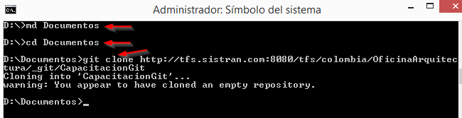
* Se valida la carpeta documentos, revisando que el contenido de la URL quede descargado, esta carpeta tambien debe contener la carpeta oculta .git.
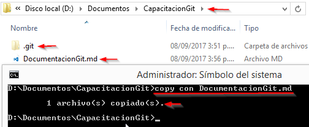  
* ### Comando para iniciar un repositorio local.   
Para iniciar un repositorio local sin necesidad de clonar un repositorio remoto se usa el siguiente comando.

> git init   

* ### Configurar Nombre y Correo Electrónico
  

>git config --global user.name "hmunevar"  
>git config --global user.email "hmunevar@sistran.com"  

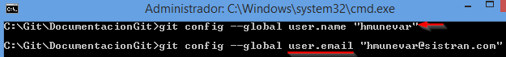   
*Si ya tenía configurado git, puede saltarse esta sección.* 
 * ### Configure las preferencias de fin de línea.  
 Esto se debe a que Windows utiliza retorno-de-carro y salto-de-linea para marcar los finales de línea de sus archivos. Mientras que Mac y Linux utilizan solamente el caracter de salto-de-linea.  
 
>git config --global core.autocrlf true  
>git config --global core.safecrlf true  
  
* **Listado de configuraciones: muestra historial de la configuración realizada**   
  
 > git config --global --list  
 
 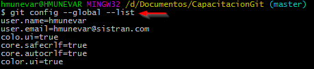  

* **GIT STATUS: Indica el estado del repositorio.**  Muestra los archivos que están pendiente por subir. 
  
 > git status   
 
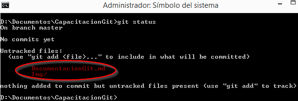   
En la carpeta va el proyecto ó documentos que se van a versionar, en este caso muestra DocumnetacionGit.md y la carpeta Img.
* **GIT ADD:Agregar archivos a nuestro proyecto,**  Es sensitivo a Mayúsculas ó minúsculas.  
 
> git add DocumentacionGit.md  

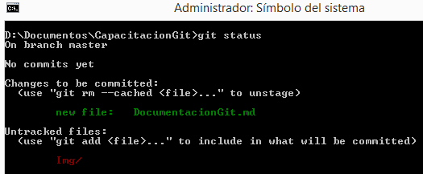  

Muestra que se adiciono el documento y que esta pendiente por adicionar la carpeta img.
* **Agregar todos los archivos pendientes por proteger: Git add -A**  
 
> git add -A    

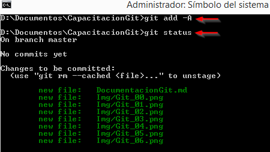  
 
> git status  
Muestra que se agrego la carpeta con todos los archivos que tenia.
* **Agregar mensaje: Git commit -m,**  Guardar los cambios con un mensaje para identificarlos.  

 > git commit -m "Se genera primera subida de 
 DocumentacioGit.md..."  
 
* **Listar todos los commits:**  Nos da una lista de todos nuestros commits con su respectiva información.  

> git log  
 
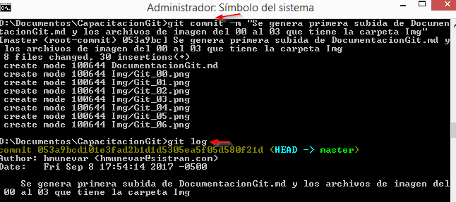  

Muestra información del Autor, correo, la fecha, hora, mensaje de cada commit y un *código que identifica cada commit (codigo Sha1).*  

**Crear Listas de log:**  Crea un archivo txt de los commits con su respectiva información.  
 
> git log > Commints.txt -- Crea la lista  
> git log  
 
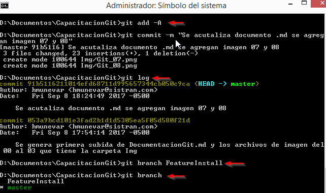  
* **Añadir contenido: Git stage**
 Añadir contenido de archivo al área de clasificación, es un sinónimo de Git add  
 
 > git stage  
  
 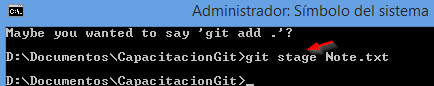 
 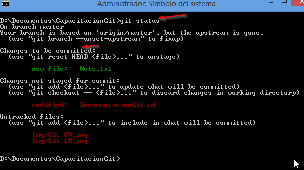   
     
 * **Realizar commit:**
 Guardar los cambios con un mensaje para identificarlos.  
  
 > git commit -m "Se realiza commit de actualización de imágenes"  
   
     
* **Mostrar todos los Commit**
 Con Git Log nos muestra todos los commit con sus mensajes.  
  
 > git log  
     
 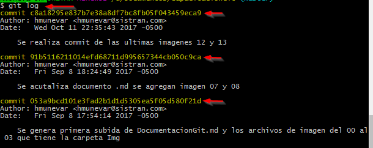 
* **Viajar a cualquier commit**
 Con Git Checkout nos permite movernos al commit que se desee.   
  
 > git Checkout   
 
 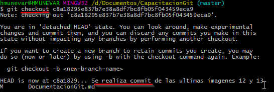
* **Viajar al último commit**
 Con Git Checkout master permite movernos al último commit.  
 
 > git Checkout master  
 
 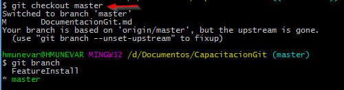  
 #### Ramas:.
* **Rama es una línea de tiempo en nuestro proyecto, que nos sirve para arreglar errores, experimentar, hacer grandes cambios. Que no afecte nuestro proyecto actual**  
* **La rama master es cuando realizamos -git ini, se crea esta rama por default. Es la rama principal y la rama estable del proyecto.**  

 > git branch   
 
 **Nos muestra todos las ramas creadas.**  
   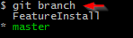  
   **Crear nuevo branch:**  Crea un archivo txt de los commits con su respectiva informaciónn.  
    
> git branch Testbranch  - Nombre como va a quedar la rama.  

  Se consulta los branch creados y luego crearmos un nuevo branch.
  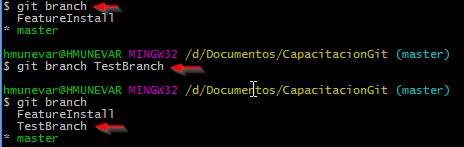  

**Al movernos en las distintas ramas se puede notar que cada una tiene una version distinta.** 
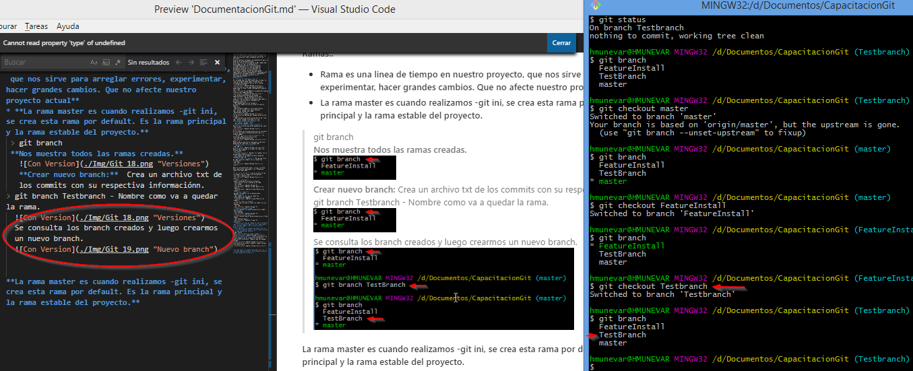  
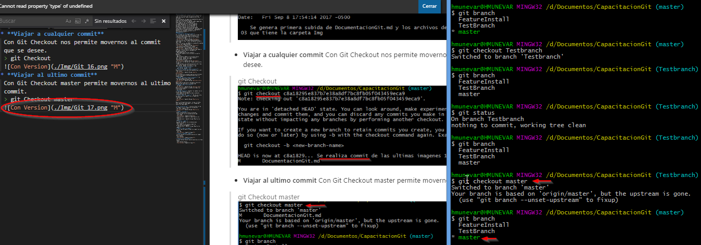 
### Eliminar una Rama.   

  git branch -D TestBranch.  
     

  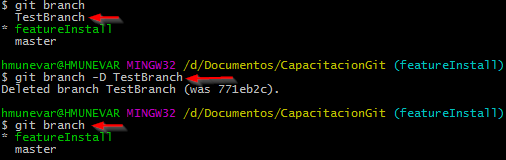 

## Fusiones:
* **Es la creacion de un nuevo Commit juntando una rama con otra.**  
* **Situarnos en la rama que va a absorver.**  

 > git merge master - Desde la rama FeatureInstall se absorve lo que tenia la rama master.  
  
 **Nos muestra la información del merge realizado.**  
   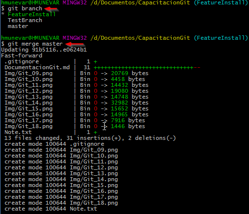  
 **Crear una Rama y quedar en ella al mismo tiempo:** Se crea la nueva rama y quedamos en ella sin necesidad de usuar el checkout.   
 
 > git checkout -b TestBranch
    
  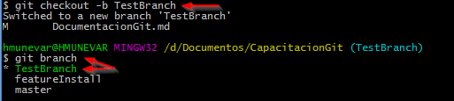  

  **Git Remote:**  Generar la misma version de lo que esta en el Hub con lo que esta en su PC´s.  
      
> git remote add origin  http://tfs.sistran.com:8080/tfs/colombia/OficinaArquitectura/_git/CapacitacionGit   
> git remote -v 

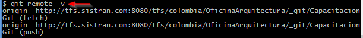 

 # SourceTree:
**Sourcetree simplifica la forma en que interactúa con sus repositorios Git.**  

Repositorio compartido de Team Explorer-Connect.  

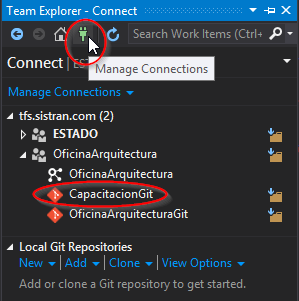  
#### Instalar SourceTree.  
**Despues de tener la URL del proyecto, se puede clonar, adicionar a SourceTree.** 
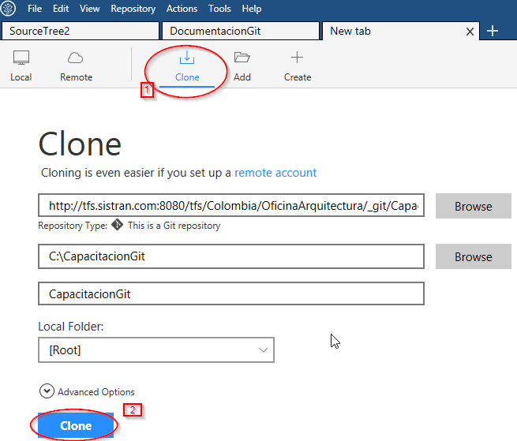
* **Clonar para descargar todo el proyecto que se encuentra con una versión estable, se usa para no contribuir, no cambiar en el proyecto.** 
* **Add es para adicionar lo que tenemos en nuestra maquina con lo que está en el proyecto.**  
 ### SourceTree interfaz grafica:
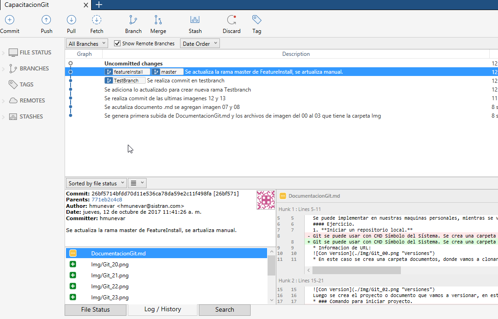  
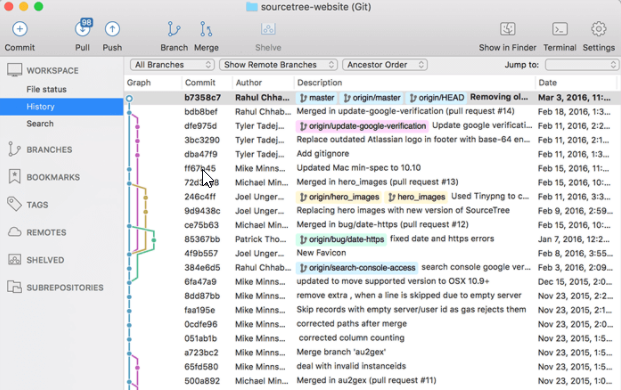  
 ### SourceTree interfaz grafica:  
 Se puede dirigir a cualquiera de las ramas o cualquiera de los branch con doble click. 
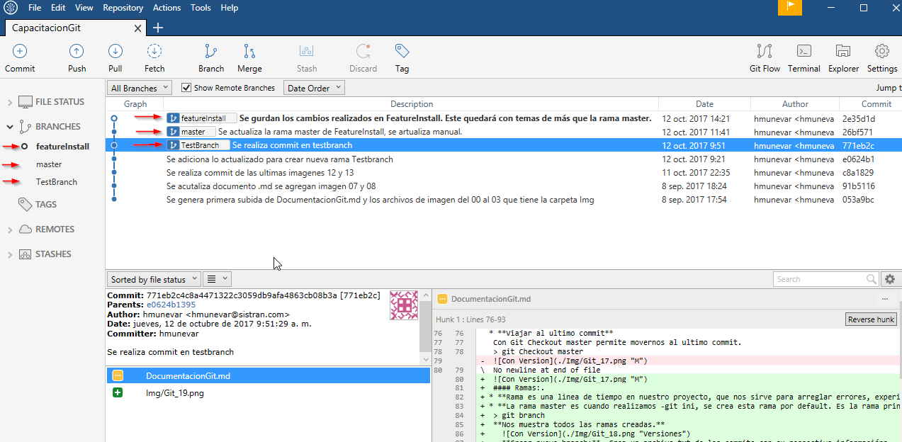  
**Relacionar con nuestro repositorio remoto que está creado en VS.**  

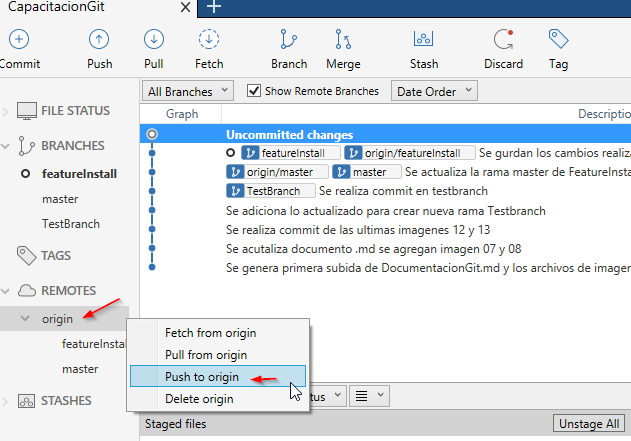  
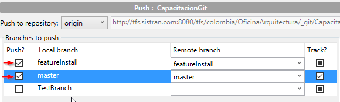  
* **Se realiza Push para subir al repositorio.** 
* **Se Selecciona el branch que se necesita consultar el estado actual, nos indica que archivos están pendientes por protejer.**  
* **Stage All, selecciona todos los archivos que se dejan en un estado intermedio listos para subir al repositorio.**   

 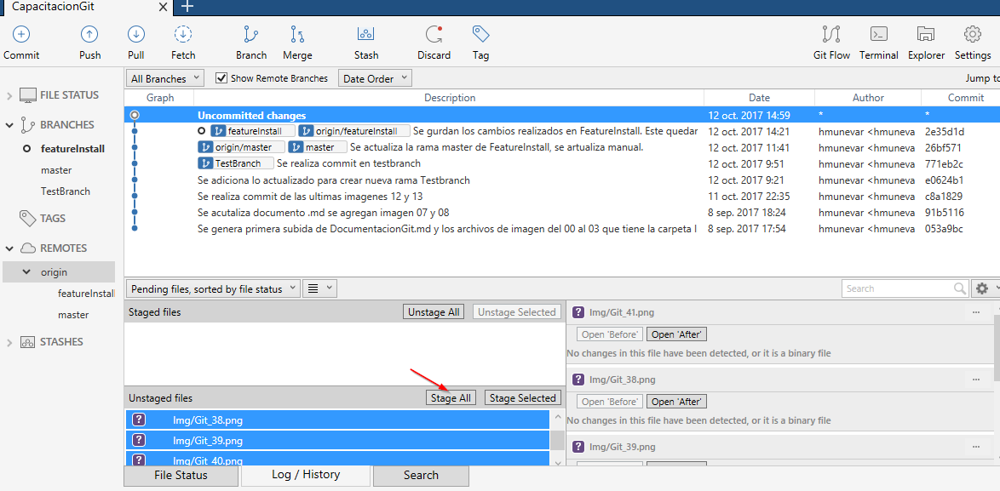
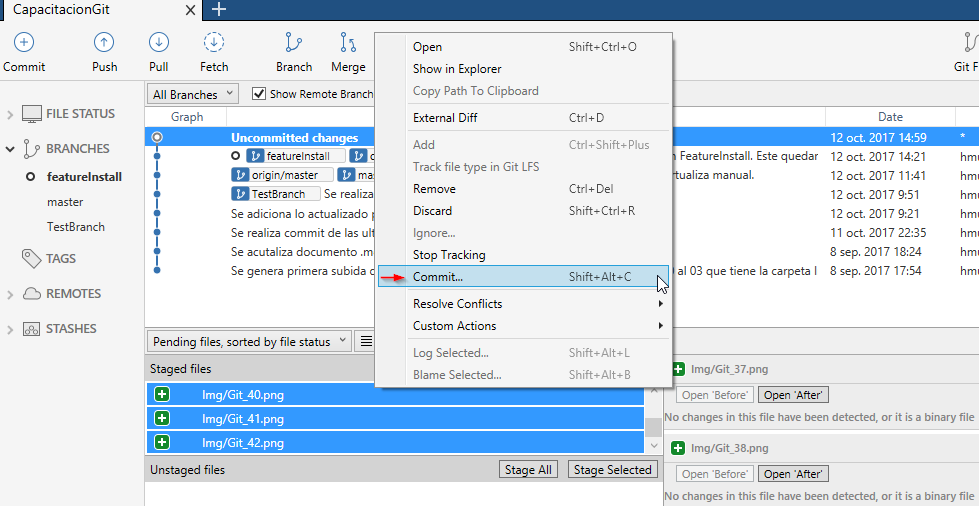
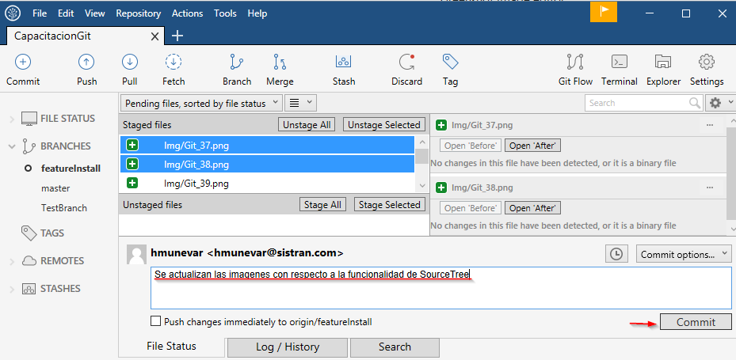  
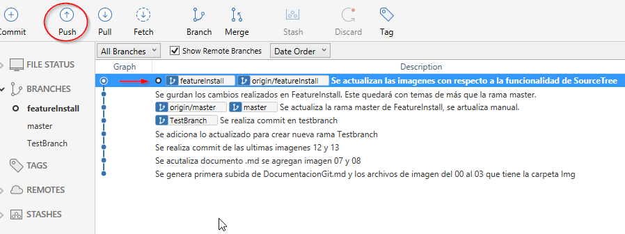  
